<div align="center">
  <h1>🎚️ Spectrum — Windows WASAPI Audio Spectrum Visualizer</h1>
  <p><strong>Real-time system-audio analysis with precise frequency-band measurement and multiple live visualizations.</strong></p>
  <p><code>▁ ▂ ▃ ▅ ▇ █ ▇ ▅ ▃ ▂ ▁ &nbsp; S P E C T R U M &nbsp; ▁ ▂ ▃ ▅ ▇ █ ▇ ▅ ▃ ▂ ▁</code></p>
  <table>
    <tr>
      <td></td>
      <td></td>
      <td></td>
      <td></td>
    </tr>
  </table>
  <p><strong>83 logarithmic bands</strong> · <strong>18 visualization modes</strong> · <strong>11 colour themes</strong> · <strong>up to 60 FPS</strong></p>
</div>
A .NET Framework 4.8 Windows Forms application that captures your system's audio output in real time and renders it as an animated frequency spectrum using 83 vertical bars. Audio capture is handled by BASS and BassWASAPI via Windows WASAPI loopback.

---

<a id="overview"></a>
## ⚡ At a Glance

| 🎚️ Frequency Analysis | 🎬 Visualization | 🎨 Customization | ⚡ Presentation |
|:---:|:---:|:---:|:---:|
| **83 bands** | **18 modes** | **11 themes** | **Up to 60 FPS** |
| **20 Hz – 20 kHz** | Runtime switching | **5 effects + `None`** | **~32 ms analysis** |

### 🧭 Navigation

[**✨ Features**](#features) · [**🎛️ Modes**](#modes) · [**🪄 Styles**](#styles) · [**🎨 Themes**](#themes) · [**⚙️ Configuration**](#configuration) · [**🏗️ Build**](#build) · [**🧪 Tests**](#tests) · [**📐 Measurement**](#measurement) · [**❓ FAQ**](#faq)

### ⌨️ Keyboard Controls

| Shortcut | Action |
|:---:|---|
| <kbd>Ctrl</kbd> + <kbd>M</kbd> | Cycle visualization modes |
| <kbd>Ctrl</kbd> + <kbd>T</kbd> | Cycle colour themes |
| <kbd>Ctrl</kbd> + <kbd>R</kbd> | Open Fixed/Random rotation settings |
| <kbd>F12</kbd> | Toggle always-on-top |

### 🚀 Quick Start

```text
1. Open Spectrum.sln in Visual Studio 2022
2. Build the Release configuration
3. Run Spectrum.exe from Spectrum/bin/Release/
```

> [!TIP]
> Spectrum automatically captures the Windows default audio output through WASAPI loopback, so normal use does not require selecting an input device.

---

<a id="features"></a>
## ✨ Features

> [!NOTE]
> Spectrum combines measurement accuracy, responsive presentation, runtime customization, and automatic device recovery in a single Windows Forms application.

- **83-bar frequency spectrum** covering 20 Hz – 20 kHz on a logarithmic scale, with a labelled frequency axis (horizontal, bottom) and a labelled level axis (vertical, 0 to -72 dBFS, both sides)
- **Reference gridlines** at -12/-24/-36/-48/-60 dBFS drawn inside each bar for at-a-glance level reading
- **Measured band levels** — each bar is the integrated power of its frequency band in dBFS (see *Measurement*)
- **18 visualization modes** selectable at runtime, with an initial value from `App.config`
- **Optional styles** with a safe `None` default: Pulse, Glow, Trail, Scanline, and Precision are enabled only where their renderer is meaningful
- **11 colour themes** selectable at runtime, including a restrained Studio reference theme
- **Live mode, style, and theme selectors** in the title bar; changes apply immediately without restarting
- **Heat-map colour gradient** with peak markers tinted to match their theme's colour at that height
- **Peak-hold markers** with configurable hold time and decay
- **Asymmetric ballistics** — fast attack, slower release per mode
- **Frame-rate independent animation** — ballistics use elapsed time; analysis runs about every 32 ms (a 25 ms timer at the 15.6 ms Windows timer resolution), display up to 60 fps
- **Silence detection** — bars fade out gracefully when no audio is playing
- **Auto device recovery** — restores capture automatically when the default audio device changes
- **Scaling layout** — bars and labels are laid out from the window's client size (the process does not declare per-monitor DPI awareness, so Windows scales it on high-DPI monitors)
- **Keyboard shortcuts** — `Ctrl+M` cycles visualization modes; `Ctrl+T` cycles colour themes
- **Fixed or Random rotation** — choose Fixed to keep selections stable, or Random to change mode and theme together at a configurable 1–240 minute interval (default 5 minutes); preferences are saved per user
- **Rotation settings shortcut** — press `Ctrl+R` to open Fixed/Random and interval settings
- **F12 toggle** — toggle always-on-top
- **Single-instance** — uses a named mutex to prevent multiple instances

---

<a id="modes"></a>
## 🎛️ Visualization Modes

<div align="center">

`Spectrum` · `Bricks` · `LED` · `Dots` · `Wave` · `Lollipop` · `Waterfall` · `Radial Spectrum` · `Contour`

`Peak Trace` · `Threshold Monitor` · `Band Matrix` · `Octave Spectrum` · `Level Change` · `Orbit History` · `Octave Waterfall` · `Level Change Map` · `Frequency Ribbon`

</div>

Choose a visualization mode from the **Mode** selector in the title bar to change it immediately. The
supported modes are:

| Mode | Best For |
|---|---|
| `Spectrum` (fallback) | All-around; smooth continuous real-time frequency analysis |
| `Bricks` (configured startup mode) | Retro block aesthetic; 80s/Synthwave music |
| `LED` | Professional peak meter; recording studios |
| `Dots` | Smooth minimal style; ambient music |
| `Wave` | Flowing organic motion; lo-fi / chill-hop |
| `Lollipop` | Thin frequency stems with a marker showing each current level |
| `Waterfall` | Scrolling history of recent frequency levels |
| `Radial Spectrum` | Frequency bands arranged around a circle |
| `Contour` | Connected line across the measured frequency bands |
| `Peak Trace` | Current spectrum with a short frequency-history trace |
| `Threshold Monitor` | Current band levels classified around a visible monitoring threshold |
| `Band Matrix` | Compact single-frame 83-band matrix |
| `Octave Spectrum` | Ten grouped octave-range meters; visible band powers are summed before display conversion |
| `Level Change` | Per-band frame-to-frame displayed-level change; it is not a power-domain spectral-flux measurement |
| `Orbit History` | Radial frequency display with short historical rings |
| `Octave Waterfall` | Scrolling grouped-octave history |
| `Level Change Map` | Compact matrix of per-band frame-to-frame displayed-level change; it is not a transient detector |
| `Frequency Ribbon` | Layered recent frequency contours |

<a id="styles"></a>
## 🪄 Visual Styles

> **Style model:** the visualization mode owns the geometry; the selected style adds a compatible presentation effect on top of that mode.

Choose a style from the **Style** selector to overlay an effect without changing the selected mode's
geometry. `None` is the default and is always safe. Every style is derived from the current display frame or
captured display-frame history; no style generates autonomous motion. `Pulse` and Glow are used only on
continuous or meter-oriented renderers, while Trail, Scanline, and Precision are exposed only for renderers
that implement them. Unsupported combinations show `None` rather than implying that an effect is active.
Random rotation selects a valid complete Mode × Style × Theme combination.

| Style | Effect |
|---|---|
| `None` (default) | No overlay |
| `Pulse` | Brightens in proportion to the current signal level |
| `Glow` | Adds a soft level-driven halo |
| `Trail` | Shows recent captured signal peaks or contours |
| `Scanline` | Marks the current aggregate signal level |
| `Precision` | Adds static analytical reference guides |

<a id="themes"></a>
## 🎨 Colour Themes

> **Theme model:** themes affect the signal palette and the surrounding application/control/grid colours while keeping application chrome visually subordinate to the signal.

Choose a palette from the **Theme** selector in the title bar to change bar colours immediately. Themes
apply semantic application, control, grid, and visualization colors in addition to their signal palette.
Application chrome remains neutral and subordinate to active signal data.

| Theme | Palette | Best For |
|---|---|---|
| `ClassicSmooth` (default) | Green → yellow → orange, red peak | Traditional VU/spectrum look |
| `Ice` | Blue → cyan → soft ice peak | Cool, calm analysis |
| `Sunset` | Amber → coral → pale gold peak | Warm, restrained analysis |
| `MonoCyan` | Blue-cyan lightness ladder | Clean technical display |
| `Synthwave` | Violet → magenta → softened cyan peak | Restrained retro character |
| `Aurora` | Emerald → cyan → pale lavender peak | Calm luminous analysis |
| `Obsidian Gold` | Warm gold → pale gold peak | Premium warm display |
| `Midnight Prism` | Violet → cyan → soft ice peak | Controlled nocturnal contrast |
| `Emerald Noir` | Emerald → jade → mint peak | Refined green-on-neutral display |
| `Crimson Velvet` | Crimson → rose → blush peak | Rich, controlled warm contrast |
| `Studio` | Teal → blue on graphite/slate chrome | Professional reference theme |

---

<a id="configuration"></a>
## ⚙️ Configuration

> [!IMPORTANT]
> Saved per-user selections take precedence over `App.config` on later launches.

`App.config` still supplies the initial mode, style, and theme when the application starts:

Runtime selections apply immediately for the current session and do not modify `App.config`.
The selected mode, style, and theme, Fixed/Random choice, and random interval are saved in the current Windows user's application settings; saved choices take precedence over `App.config` on later launches. Legacy `Mode=Pulse` migrates to `Bricks` with `None`, `Mode=Glow` migrates to `Spectrum` plus `Glow`, and retired `Center`, `Mirror`, `Note Map`, and `Ambient Particles` values migrate safely to retained modes.

```xml
<appSettings>
  <add key="Mode" value="Bricks"/>
  <add key="Style" value="None"/>
  <add key="Theme" value="ClassicSmooth"/>
</appSettings>
```

<a id="requirements"></a>
## 📋 Requirements

> [!IMPORTANT]
> The application targets **Windows** and **.NET Framework 4.8** and depends on the included native BASS libraries.

- Windows OS
- [.NET Framework 4.8](https://dotnet.microsoft.com/download/dotnet-framework/net48)
- Visual Studio 2022 (or MSBuild)
- The native DLLs `bass.dll` and `basswasapi.dll` (included in `Ref_Files/`)

---

<a id="build"></a>
## 🏗️ Build

Open `Spectrum.sln` in Visual Studio and build (`Ctrl+Shift+B`), or:

```bash
msbuild Spectrum.sln -restore -p:RestorePackagesConfig=true -p:Configuration=Release
```

The output is placed in `Spectrum/bin/Release/`.

<a id="tests"></a>
## 🧪 Tests

> [!NOTE]
> The test suite is signal-driven and deterministic, covering analysis correctness as well as timing, concurrency, stereo behavior, and per-frame cost.

`Spectrum.Tests` (xUnit, .NET Framework 4.8) validates the analysis with deterministic synthetic signals:
FFT correctness, band-plan geometry, a tone at every bar's centre, amplitude accuracy, band-boundary
and sweep behaviour, multi-tone independence, white/pink noise, stereo semantics (including anti-phase),
numerical safety, lock-free sample-history consistency under a concurrent producer, frame-rate
independent ballistics and end-to-end onset/release timing, instrument-like signals, and per-frame cost.

```bash
dotnet test Spectrum.Tests/bin/Release/net48/Spectrum.Tests.dll
# The application runs as a 32-bit process; to test under x86:
vstest.console.exe Spectrum.Tests/bin/Release/net48/Spectrum.Tests.dll /Platform:x86
```

<a id="running"></a>
## ▶️ Running

> [!TIP]
> No input-device selection is required for normal use: capture starts from the Windows default audio output through WASAPI loopback.

Run `Spectrum.exe` from the build output directory. The application automatically selects the Windows default audio output device (WASAPI loopback) and begins capturing.

<a id="dependencies"></a>
## 📦 Dependencies

| Library | Version | Source |
|---|---|---|
| `Bass.Net` | 2.4.11.1 | Included in `Ref_Files/` |
| `NAudio` | 1.7.3 | Included in `Ref_Files/` |
| `bass.dll` | — | Native BASS audio library |
| `basswasapi.dll` | — | Native BassWASAPI extension |

---

<a id="project-structure"></a>
## 🗂️ Project Structure

The repository keeps capture/analysis, DSP, presentation ballistics, rendering, configuration, and native references clearly separated:

```text
Spectrum/
└── Spectrum/
    ├── Analyzer.cs                  # Device handling, WASAPI capture, analysis scheduling, publication
    ├── Dsp/                         # Measurement: FFT, band plan, band-power analyzer, dB scale, sample history
    ├── BarBallistics.cs             # Time-based attack / release / peak-hold math used by the bars
    ├── FormAudioSpectrum.cs         # Main form — renders bars, handles events
    ├── FormAudioSpectrum.Designer.cs
    ├── VerticalProgressBar.cs       # Custom control — one animated bar
    ├── Ambiance Theme.cs            # Visual theme applied to the form
    ├── Device.cs                    # WASAPI device descriptor
    ├── Taskbar.cs                   # Windows taskbar progress state helper
    ├── Program.cs                   # Entry point with single-instance mutex
    ├── App.config                   # Mode configuration
    ├── Ref_Files/                   # Bass.Net.dll, NAudio.dll, bass.dll, basswasapi.dll
    └── Spectrum.csproj
```

---

<a id="measurement"></a>
## 📐 Measurement

### Signal pipeline

```mermaid
flowchart LR
    A[Windows audio output] --> B[WASAPI loopback]
    B --> C[Lock-free sample history]
    C --> D[DC removal + Hann window]
    D --> E[FFT]
    E --> F[One-sided bin power]
    F --> G[Stereo power average]
    G --> H[83 logarithmic bands]
    H --> I[dBFS mapping]
    I --> J[Time-based ballistics]
    J --> K[Visualization renderer]
```



> [!NOTE]
> The visual presentation does not hide the physical time/frequency trade-off described below; low-frequency bands intentionally use longer analysis windows for resolution.

**What a bar shows.** Bar *i* is the power of the captured signal inside a fixed frequency band, in dB
relative to a full-scale sine (dBFS): a full-scale sine whose energy lies inside one band reads 0 dBFS.
The 83 bands are contiguous and logarithmically spaced (constant ratio ≈ 1/8.3 octave); band *i* is centred
at 20·1000^(i/82) Hz and its edges are the geometric midpoints to its neighbours, so every frequency between
19.2 Hz and 20.9 kHz belongs to exactly one bar. No frequency weighting, bass/treble boost or per-frame
normalization is applied, so pink noise reads flat and white noise rises 3 dB per octave.

**Pipeline.** WASAPI loopback (32-bit float) → lock-free sample history (written by the capture callback) →
every analysis tick (~32 ms): latest frames per channel → window-weighted DC removal → periodic Hann window → FFT →
one-sided bin power 2|X|²/(N·Σw²) (Parseval-normalized, so summed bins equal signal power) →
mean of left/right channel power (anti-phase content cannot cancel) → bin power integrated into each band
with fractional weights for bins that straddle a band edge → 10·log10 → fixed display range −72…0 dBFS mapped
linearly to bar height (levels below about −71.6 dBFS, the two lowest byte steps, are gated to an empty bar) → time-based presentation ballistics.

**Resolution.** Each band uses the shortest window that places at least 4 bins (the Hann main lobe) inside it:
≈85 ms above ~0.5 kHz, ≈171 ms around 0.3–0.5 kHz, ≈341 ms below (window lengths scale with the sample rate).
Short windows cut latency (a 1 kHz onset reaches 90 % in ~50 ms instead of ~150 ms with a single 341 ms
window); the long window keeps bass resolution. Below ~140 Hz the bars are narrower than the window's main
lobe (≈11.7 Hz at 48 kHz): a pure bass tone lights a small cluster of neighbouring bars, with the strongest
bar at the tone's frequency, and reads up to ~5 dB low in its own bar. This is a physical time/frequency limit, not something the display hides.

**Stereo.** The front left/right pair is analysed separately and powers are averaged: L = R reads like mono,
one channel alone reads −3 dB, and phase between channels never changes the level. On multichannel devices
only the front pair is measured.

**Timing (default Spectrum mode).** Attack: full-scale rise in 45 ms. Release: exponential, time constant
380 ms. Peak marker: 300 ms hold, then a linear fall, independent of the bar. Bricks use ±2 px (≈0.5 dB) hysteresis so a level
hovering at a brick boundary does not flicker (steady-level display error ≤ ±1.44 dB); the animation runs at ~64 fps. Other visual modes keep their
own presentation presets.

---

<a id="faq"></a>
## ❓ FAQ

> Common questions about high-frequency content and low-frequency response timing.

**The top bars are empty or much lower on some songs. Is something broken?**
No. Lossy encoders remove high frequencies: most MP3s are encoded with a low-pass at 15–19 kHz, so bars 80–82
(16.2–20.9 kHz) correctly show nothing for them (a scan of a 368-song MP3 library found 231 files cut at 15–16 kHz;
every empty top bar lay above the file's own cut-off). White or pink noise lights all 83 bars (a 20 kHz test tone lights bar 82).

**Why do bass bars move later than cymbals?**
Resolving bass needs a longer analysis window (≈341 ms below ~280 Hz versus ≈85 ms above ~560 Hz), so bass
bars trail treble bars by roughly 0.1 s. This is the time/frequency trade-off of any FFT analyzer.

<a id="technical-notes"></a>
## 🔧 Technical Notes

> Implementation details for device-change recovery, stream-hang detection, and silence publication.

- Device changes (plug/unplug, default device switch) are detected via `IMMNotificationClient` and trigger an automatic re-initialisation on the UI thread
- A hang detector monitors consecutive identical WASAPI levels and forces a device reset if the stream appears stuck
- Silence (zero level, or no new captured frames) publishes the floor; bars then decay with their release time

---

<div align="center">

### 🎚️ Spectrum

**Windows Audio Spectrum Visualizer · .NET Framework 4.8 · WASAPI Loopback**

</div>
